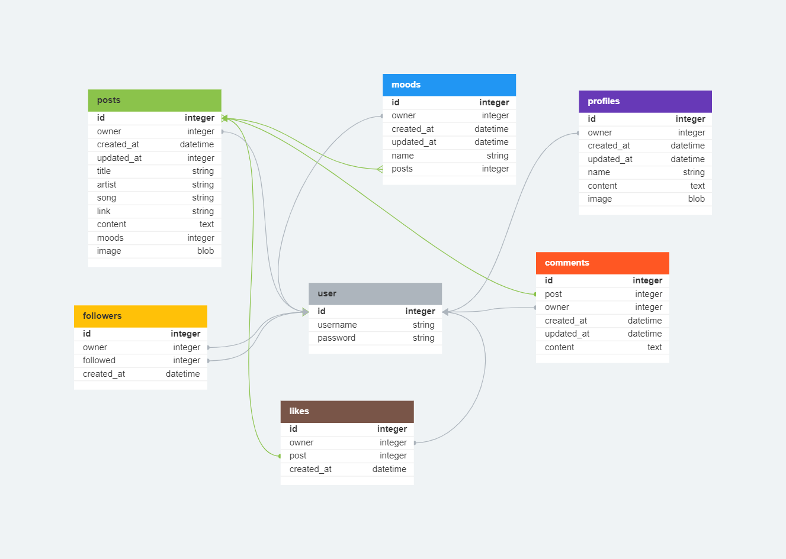

# The BeatBuddies API

BeatBuddies in an app for sharing music tips with your friends. You can make posts containing a song, image, content and "moods" of your choice. Moods can be whatever the user wants, and are tags for each post that communicates what mood/feeling/genre/general vibe the song has. Posts can be liked and commented so the users can share their feelings, and the users can follow each other to get a custom feed.

The project is a part of the [Code Institute Full Stack Developer Program](https://codeinstitute.net/se/full-stack-software-development-diploma/) and is my fifth and last "portfolio project", with a specialization on advanced front end.

The main goal of the project was to create a front end and a back end part and then successfully connect the two.

<u>Links</u>

The live deployed app: https://beatbuddies.herokuapp.com/

The front end repository: https://github.com/Johneriksson88/BeatBuddies

The live deployed API: https://beatbuddies-api-a72df4dfc93e.herokuapp.com/ (looks best with a browser Json formatter)

The back end repository: https://github.com/Johneriksson88/bb-api

## Table Of Contents:

- [User Stories and Tasks](#user-stories-and-tasks)
- [Database Schema](#database-schema)
  - [Future Features](#future-features)
- [Testing](#testing)
- [Technologies Used](#technologies-used)
  - [Languages and Frameworks Used](#languages-and-frameworks-used)
  - [Python Modules Used](#python-modules-used)
  - [Packages Used](#packages-used)
  - [Programs and Tools Used](#programs-and-tools-used)
- [Deployment](#deployment)
  - [Create a Database](#create-a-database)
  - [Forking the GitHub Repository](#forking-the-github-repository)
  - [Making a Local Clone](#making-a-local-clone)
  - [Deploying with Heroku](#deploying-with-heroku)
- [Credits](#credits)
  - [Online resources](#online-resources)
  - [Code Institute](#code)
  - [Acknowledgments](#acknowledgments)

## User stories

This project utilized an agile approach, and all the user stories can be viewed [here](https://github.com/Johneriksson88/BeatBuddies/issues).

## Database models and schema

For the backend part of BeatBuddies I used the [Django REST framework](https://www.django-rest-framework.org/). I first created the models, and then the serializers and views.
The database schema were planned out in [dbdesigner.net](https://www.dbdesigner.net/). DBDesigner is an intuitive browser-based tool to create database schemas.

The main models and their respective fields can be seen below:



### Contact model

The contact model is for storing user feedback messages and has no relation to the above models. It consists of the following fields:

| name       | type             |
| ---------- | ---------------- |
| owner      | foreignkey(User) |
| created_at | datetime         |
| updated_at | datetime         |
| title      | charfield        |
| email      | charfield        |
| message    | textfield        |

### User model

The User model takes advantage of the inbuilt User model of Django REST, hence it can not be found in the API directory. It consists of many optional fields, but for this app I am only using the username and password fields.

### Profiles model

The Profiles model contains the information presented on the profile page. It connects to the User model through a one-to-one relationship.

### Posts model

The Posts model contains all the information presented in the Post component, which is used on multiple pages. It connects to the Moods model through a many-to-many relationship (one post can have several moods and one mood can be in several posts) and to the User, Comments and Like models through a one-to-one relationship respectively.

### Moods model

The Moods model contains all the different moods created by the users. The moods are displayed on posts that contains them, as well as on the moods and mood page. It connects to the User model through a one-to-one field and to the Posts model through a many-to-many relationship (explained in the Posts model above).

### Likes model

The Likes model holds the likes created by users. It connects to the Posts and User models through one-to-one relationships respectively.

### Comments model

The Comments model holds all the comments displayed under the individual posts on the post page. It connects to the Posts and User models through one-to-one relationships respectively.

### Followers model

The followers model holds all the links between the users following each other. This was the model that was the hardest for me to get my head around. Basically, the owner field holds the user following another user, and the followed field holds the user that is being followed. Both through one-to-one fields.

## Testing

### Manual Testing

### Endpoint Testing

I manually tested that all the links go to the correct endpoints:

| URL                | Passed             |
| ------------------ | ------------------ |
| root               | :white_check_mark: |
| /comments/         | :white_check_mark: |
| /comments/\<id>/   | :white_check_mark: |
| /houses/           | :white_check_mark: |
| /houses/\<id>/     | :white_check_mark: |
| /contacts/         | :white_check_mark: |
| /contacts/\<id>/   | :white_check_mark: |
| /followers/        | :white_check_mark: |
| /followers/\<id>/  | :white_check_mark: |
| /likes/            | :white_check_mark: |
| /likes/\<id>/      | :white_check_mark: |
| /posts/            | :white_check_mark: |
| /posts/\<id>/      | :white_check_mark: |
| /profiles/         | :white_check_mark: |
| /profiles/\<id>/   | :white_check_mark: |
| /moods/            | :white_check_mark: |
| /mood/\<id>/       | :white_check_mark: |
| /createmood/\<id>/ | :white_check_mark: |

### CRUD Functionality Testing

I manually tested the CRUD (Create, Read, Update, Delete) functionality of all endpoints, and that the actions were correctly limited to authenticated users where defined.

#### Comments

| App      | Action      | Authenticated | Unauthenticated | Passed             |
| -------- | ----------- | ------------- | --------------- | ------------------ |
| Comments | Create      | 201 Response  | 403 Response    | :white_check_mark: |
| Comments | Read (List) | 200 Response  | 200 Response    | :white_check_mark: |
| Comments | Update      | 200 Response  | 403 Response    | :white_check_mark: |
| Comments | Delete      | 200 Response  | 403 Response    | :white_check_mark: |

#### Contact

| App      | Action | Authenticated | Unauthenticated | Passed             |
| -------- | ------ | ------------- | --------------- | ------------------ |
| Contacts | Create | 201 Response  | N/A             | :white_check_mark: |

#### Followers

| App       | Action      | Authenticated | Unauthenticated | Passed             |
| --------- | ----------- | ------------- | --------------- | ------------------ |
| Followers | Create      | 201 Response  | N/A             | :white_check_mark: |
| Followers | Read (List) | 200 Response  | 200 Response    | :white_check_mark: |
| Followers | Update      | 200 Response  | 403 Response    | :white_check_mark: |
| Followers | Delete      | 200 Response  | 403 Response    | :white_check_mark: |

#### Likes

| App   | Action      | Authenticated | Unauthenticated | Passed             |
| ----- | ----------- | ------------- | --------------- | ------------------ |
| Likes | Create      | 201 Response  | 403 Response    | :white_check_mark: |
| Likes | Read (List) | 200 Response  | 200 Response    | :white_check_mark: |
| Likes | Update      | 200 Response  | 403 Response    | :white_check_mark: |
| Likes | Delete      | 200 Response  | 403cResponse    | :white_check_mark: |

#### Moods

| App   | Action      | Authenticated | Unauthenticated | Passed             |
| ----- | ----------- | ------------- | --------------- | ------------------ |
| Moods | Create      | 201 Response  | 403 Response    | :white_check_mark: |
| Moods | Read (List) | 200 Response  | 200 Response    | :white_check_mark: |

#### Posts

| App   | Action      | Authenticated | Unauthenticated | Passed             |
| ----- | ----------- | ------------- | --------------- | ------------------ |
| Posts | Create      | 201 Response  | 403 Response    | :white_check_mark: |
| Posts | Read (List) | 200 Response  | 403 Response    | :white_check_mark: |
| Posts | Update      | 200 Response  | 403 Response    | :white_check_mark: |
| Posts | Delete      | 200 Response  | 403 Response    | :white_check_mark: |

#### Profiles

| App      | Action      | Authenticated | Unauthenticated | Passed             |
| -------- | ----------- | ------------- | --------------- | ------------------ |
| Profiles | Create      | 201 Response  | 201 Response    | :white_check_mark: |
| Profiles | Read (List) | 200 Response  | 200 Response    | :white_check_mark: |
| Profiles | Update      | 200 Response  | 403 Response    | N/A                |
| Profiles | Delete      | N/A           | N/A             | N/A                |

## Technologies Used

### Languages and Frameworks

- [Python](https://www.python.org/)
  - A programming language that lets you work quickly and integrate systems more effectively
- [Django](https://pypi.org/project/Django/3.2.14/)
  - High-level Python Web framework that encourages rapid development and clean, pragmatic design
- [Django REST 3.14.0](https://www.django-rest-framework.org/)
  - a powerful Python based framework for creating APIs

### Python Modules

- [pathlib](https://docs.python.org/3/library/pathlib.html)
  - Offers classes representing filesystem paths with semantics appropriate for different operating systems
- [os](https://docs.python.org/3/library/os.html)
  - Provides a portable way of using operating system dependent functionality

### Libraries

- [cloudinary](https://pypi.org/project/cloudinary/1.30.0/)
  - Image hosting
- [django-cloudinary-storage](https://pypi.org/project/django-cloudinary-storage/0.3.0/)
  - Facilitates integration with Cloudinary by implementing Django Storage API
- [dj-database-url](https://pypi.org/project/dj-database-url/0.5.0/)
  - To utilize the DATABASE_URL environment variable to configure the Django application
- [django-allauth](https://pypi.org/project/django-allauth/0.51.0/)
  - Integrated set of Django applications addressing authentication, registration, account management as well as 3rd party (social) account authentication
- [dj-rest-auth](https://pypi.org/project/dj-rest-auth/2.2.5/)
  - Drop-in API endpoints for handling authentication securely in Django Rest Framework
- [django-filter](https://pypi.org/project/django-filter/22.1/)
  - Reusable Django application allowing users to declaratively add dynamic QuerySet filtering from URL parameters.
- [djangorestframework-simplejwt](https://pypi.org/project/djangorestframework-simplejwt/5.2.1/)
  - JSON Web Token authentication plugin
- [django-cors-headers](https://pypi.org/project/django-cors-headers/3.13.0/)
  - Cross-Origin Resource Sharing (CORS) headers to responses
- [gunicorn](https://pypi.org/project/gunicorn/20.1.0/)
  - WSGI HTTP Server for UNIX
- [Pillow](https://pypi.org/project/Pillow/9.2.0/)
  - Adds image processing capabilities to the Python interpreter
- [psycopg2](https://pypi.org/project/psycopg2/2.9.3/)
  - Python-PostgreSQL Database Adapter
- [python-dotenv](https://pypi.org/project/python-dotenv/0.21.0/)
  - Reads key-value pairs from a .env file and can set them as environment variables

### Programs and Tools Used

- [DB Designer](https://www.dbdesigner.net/)
  - to create the database schema
- [GitHub](https://github.com/)
  - version control and hosting during development
- [GitPod](https://gitpod.io/)
  - in-browser editor

## Deployment

<u>In the IDE</u>

1. Install gunicorn and django-cors-headers in the terminal:
   ```
   pip3 install gunicorn django-cors-headers
   ```
2. Update the requirements.txt-file:
   ```
   pip freeze --local > requirements.txt
   ```
3. Create a Procfile in the root directory and add these commands:
   ```
   release: python manage.py makemigrations && python manage.py migrate
   web: gunicorn drf_api.wsgi
   ```
4. Add the "ALLOWED_HOSTS" variable in settings.py:
   ```
   ALLOWED_HOSTS = ['localhost', '<your_app_name>.herokuapp.com']
   ```
5. Add corsheaders to INSTALLED_APPS:

   ```
   INSTALLED_APPS = [
   ...
   'dj_rest_auth.registration',
   'corsheaders',
   ...
   ]
   ```

6. Add corsheaders middleware to the TOP of the MIDDLEWARE:
   ```
     MIDDLEWARE = [
     'corsheaders.middleware.CorsMiddleware',
     ...
       ]
   ```
7. Under the MIDDLEWARE list, set the ALLOWED_ORIGINS for the network requests made to the server:
   ```
   if 'CLIENT_ORIGIN' in os.environ:
    CORS_ALLOWED_ORIGINS = [
        os.environ.get('CLIENT_ORIGIN')
    ]
   else:
    CORS_ALLOWED_ORIGIN_REGEXES = [
        r"^https://.*\.gitpod\.io$",
    ]
   ```
8. Enable sending cookies in cross-origin requests so that users can get authentication functionality:

   ```
   else:
    CORS_ALLOWED_ORIGIN_REGEXES = [
        r"^https://.*\.gitpod\.io$",
    ]

   CORS_ALLOW_CREDENTIALS = True
   ```

9. To be able to have the front end app and the API deployed to different platforms, set the JWT_AUTH_SAMESITE attribute to 'None'. Without this the cookies would be blocked:
   ```
   JWT_AUTH_COOKIE = 'my-app-auth'
   JWT_AUTH_REFRESH_COOKE = 'my-refresh-token'
   JWT_AUTH_SAMESITE = 'None'
   ```
10. Again, make sure the requirements.txt-file is up to date:
    ```
    pip freeze --local > requirements.txt
    ```

<u>In Heroku</u>

1. Follow steps as presented in the deployment of the [front end](#front-end) above, up to step 6
2. Add all necessary config vars:
   ```
   SECRET_KEY = [your-django-secret-key]
   CLOUDINARY_URL = [your-cloudinary-url]
   DATABASE_URL = [your-database-url]
   DISABLE_COLLECTSTATIC = 1
   ALLOWED_HOST = [your-deployed-api-url]
   CLIENT_ORIGIN = [your-deployed-front-end-url]
   ```
3. Go to the Deploy tab, scroll down and hit deploy
4. Click the "Open app" button on the top and make sure the app is working

## Credits

### Online resources

- [Django Documentation](https://docs.djangoproject.com/en/3.2/)
- [Django REST Documentation](https://www.django-rest-framework.org/)
- [Python Documentation](https://docs.python.org/3/)
- [Stack Overflow](https://stackoverflow.com/)

### Bugs

All bugs are documented in the [readme](https://github.com/Johneriksson88/BeatBuddies/blob/main/README.md) of the front end repository.

### Code

- The API was based on the DRF-API tutorial on Code Institute
  - [Code Institute DRF-API Tutuorial Project](https://github.com/Code-Institute-Solutions/drf-api)
